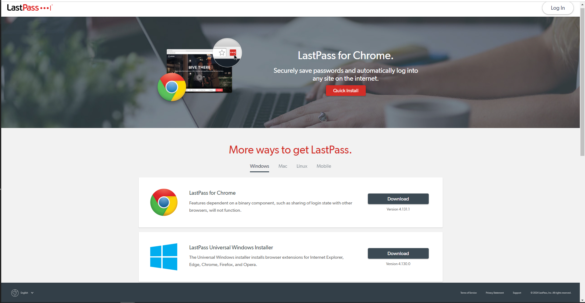

# Setting up and using a password manager

As a business, managing your different online accounts and keeping them secure can be stressful. A password manager can help streamline this process. In this guide, you will learn how to set up and use a password manager.

## What is a Password Manager?
A _password manager_ is a tool that helps users and businesses create, manage, and fill in passwords across various online accounts, so that you do not have to worry about remembering all of them. It is a secure tool that helps store all your passwords - including subscriptions your business may use, or your social media accounts.

There are various password managers available for free or as a paid service for businesses such as 1Password, LastPass, and Bitwarden. For the purposes of this tutorial, we will be using LastPass. 

## Why LastPass?

LastPass is a comprehensive password manager that allows you to store and share passwords with your team members, while only having to remember one master password. 

## Setting up LastPass

### Installing LastPass

To begin, you need to download [LastPass](https://www.lastpass.com/). LastPass can either be added to your browser as an extension or downloaded as an application to your computer. Follow these instructions to download LastPass

1. To download LastPass, click [here](https://lastpass.com/misc_download2.php). 

2. Click on the "Quick Install" button or the corresponding browser option to add the LastPass extension to your current browser. This will open a new tab, allow your browser to add the extension.
3. Optionally, you can also click on the corresponding options to download the LastPass application directly to your computer. 
4. Open the downloaded file and follow the setup steps to install the application onto your computer.

:::note 
It is not necessary to download the LastPass application directly on to your computer as you can access all features via the website. However, it is necessary to add the extension to your browser because it allows LastPass to autofill your passwords saving you time. 
:::

### Creating a LastPass account and master password

In order to use LastPass, you will need to create an account and a master password. 

1. Go to the LastPass [website](https://www.lastpass.com/) and click the "Get LastPass Free" button on the top right corner.
2. Alternatively, if you have the application downloaded on your computer, open it and click the "Create Account" button.
3. You will be asked to input the following:
- _Email_: Your business' email address.
- _Master Password_: The master password is the key to your password manager and is the only password you will need to remember, make it strong and unique. It needs to follow the conditions in the below screenshot. This password is best known only to admin.
- _Reminder_: This is an optional field and is a prompt that you can add to remind you of your master password. 

4. Make sure to remember your master password at all times. 

### Add your passwords 

Now, let's add your business' exisiting passwords to LastPass. 

1. Log in to LastPass with your master password [here](https://lastpass.com/?ac=1).
2. Go to the Vault: this is where all your passwords are stored.
3. Click on "Add Item" or the "+" button to add passwords.
4. Enter your login details for each account such as business email, social media accounts, and subscriptions.

   

5. Save the entry.

### Organize passwords into folders
LastPass also allows you to organize password entries into different folders. Categorize your passwords to find them easily:

1. In the vault, click the "+" button on the bottom left corner and choose "Add New Folder". 
2. Name your folder, for example: "Social Media"

3. Now when you add new passwords, you can choose the folder you wish to add them to. 
4. To add existing passwords to folders, in the vault, click the edit button on the password you wish to add and choose a folder.

### Autofill passwords
LastPass autofills passwords you have added to your vault saving your business time. 

1. The browser extension and the vault both have autofill enabled by default. 
2. When you visit a login page, the LastPass icon will appear in the login fields. Click the LastPass icon to autofill your username and password. 

:::note
If you are having issues with autofill, go to your browser extension settings and make sure autofill is turned on.
:::

### Generate secure passwords
LastPass can also generate passwords for your business accounts, providing additional security.

1. In your vault, click on "Advanced Options" from the sidebar. Then, click on "Generate secure password". 
3. You can then generate a secure password based on the filters needed for the account you are creating.

 

### Back up passwords
With LastPass, you can alo regularly back up your business' passwords to have an additional storage of all your accounts.

1. In your vault, click on "Advanced Options" from the sidebar again, then click on "Export". 
2. LastPass will send your business an email to verify the export request. Click on the "Continue export" link in the email.

3. Go back to your vault, and click "Export" under "Advanced Options" again. 
4. Provide your master password to ensure that you want to download a list of your saved passwords. 

5. Open the downloaded spreadsheet to view your business' existing accounts and passwords.

## Additional Tips

Now your business has all its online accounts and passwords stored, organized, and secure! Here are some additional tips that can make your experience with a password manager smoother:

:::Tip 
- Update your browser extension and application periodically to ensure your business has the latest security features.
- Download the mobile app to manage your business' passwords wherever. 
- Set up account recovery from "Account Settings" in your vault, in case you forget your master password. 
:::

